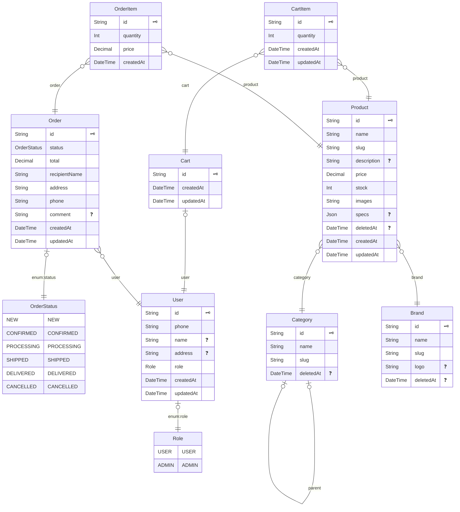

```mermaid
erDiagram

        Role {
            USER USER
ADMIN ADMIN
        }
    


        OrderStatus {
            NEW NEW
CONFIRMED CONFIRMED
PROCESSING PROCESSING
SHIPPED SHIPPED
DELIVERED DELIVERED
CANCELLED CANCELLED
        }
    
  "User" {
    String id "🗝️"
    String phone 
    String name "❓"
    String address "❓"
    Role role 
    DateTime createdAt 
    DateTime updatedAt 
    }
  

  "Category" {
    String id "🗝️"
    String name 
    String slug 
    DateTime deletedAt "❓"
    }
  

  "Brand" {
    String id "🗝️"
    String name 
    String slug 
    String logo "❓"
    DateTime deletedAt "❓"
    }
  

  "Product" {
    String id "🗝️"
    String name 
    String slug 
    String description "❓"
    Decimal price 
    Int stock 
    String images 
    Json specs "❓"
    DateTime deletedAt "❓"
    DateTime createdAt 
    DateTime updatedAt 
    }
  

  "Cart" {
    String id "🗝️"
    DateTime createdAt 
    DateTime updatedAt 
    }
  

  "CartItem" {
    String id "🗝️"
    Int quantity 
    DateTime createdAt 
    DateTime updatedAt 
    }
  

  "Order" {
    String id "🗝️"
    OrderStatus status 
    Decimal total 
    String recipientName 
    String address 
    String phone 
    String comment "❓"
    DateTime createdAt 
    DateTime updatedAt 
    }
  

  "OrderItem" {
    String id "🗝️"
    Int quantity 
    Decimal price 
    DateTime createdAt 
    }
  
    "User" |o--|| "Role" : "enum:role"
    "Category" |o--|o "Category" : "parent"
    "Product" }o--|| "Category" : "category"
    "Product" }o--|| "Brand" : "brand"
    "Cart" |o--|| "User" : "user"
    "CartItem" }o--|| "Cart" : "cart"
    "CartItem" }o--|| "Product" : "product"
    "Order" |o--|| "OrderStatus" : "enum:status"
    "Order" }o--|| "User" : "user"
    "OrderItem" }o--|| "Order" : "order"
    "OrderItem" }o--|| "Product" : "product"
```
