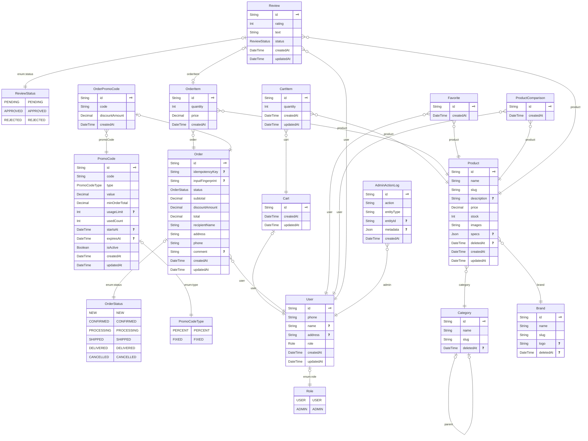

```mermaid
erDiagram

        Role {
            USER USER
ADMIN ADMIN
        }
    


        OrderStatus {
            NEW NEW
CONFIRMED CONFIRMED
PROCESSING PROCESSING
SHIPPED SHIPPED
DELIVERED DELIVERED
CANCELLED CANCELLED
        }
    


        ReviewStatus {
            PENDING PENDING
APPROVED APPROVED
REJECTED REJECTED
        }
    


        PromoCodeType {
            PERCENT PERCENT
FIXED FIXED
        }
    
  "User" {
    String id "🗝️"
    String phone 
    String name "❓"
    String address "❓"
    Role role 
    DateTime createdAt 
    DateTime updatedAt 
    }
  

  "Category" {
    String id "🗝️"
    String name 
    String slug 
    DateTime deletedAt "❓"
    }
  

  "Brand" {
    String id "🗝️"
    String name 
    String slug 
    String logo "❓"
    DateTime deletedAt "❓"
    }
  

  "Product" {
    String id "🗝️"
    String name 
    String slug 
    String description "❓"
    Decimal price 
    Int stock 
    String images 
    Json specs "❓"
    DateTime deletedAt "❓"
    DateTime createdAt 
    DateTime updatedAt 
    }
  

  "Cart" {
    String id "🗝️"
    DateTime createdAt 
    DateTime updatedAt 
    }
  

  "CartItem" {
    String id "🗝️"
    Int quantity 
    DateTime createdAt 
    DateTime updatedAt 
    }
  

  "Order" {
    String id "🗝️"
    String idempotencyKey "❓"
    String inputFingerprint "❓"
    OrderStatus status 
    Decimal subtotal 
    Decimal discountAmount 
    Decimal total 
    String recipientName 
    String address 
    String phone 
    String comment "❓"
    DateTime createdAt 
    DateTime updatedAt 
    }
  

  "OrderItem" {
    String id "🗝️"
    Int quantity 
    Decimal price 
    DateTime createdAt 
    }
  

  "Favorite" {
    String id "🗝️"
    DateTime createdAt 
    }
  

  "ProductComparison" {
    String id "🗝️"
    DateTime createdAt 
    }
  

  "Review" {
    String id "🗝️"
    Int rating 
    String text 
    ReviewStatus status 
    DateTime createdAt 
    DateTime updatedAt 
    }
  

  "PromoCode" {
    String id "🗝️"
    String code 
    PromoCodeType type 
    Decimal value 
    Decimal minOrderTotal 
    Int usageLimit "❓"
    Int usedCount 
    DateTime startsAt "❓"
    DateTime expiresAt "❓"
    Boolean isActive 
    DateTime createdAt 
    DateTime updatedAt 
    }
  

  "OrderPromoCode" {
    String id "🗝️"
    String code 
    Decimal discountAmount 
    DateTime createdAt 
    }
  

  "AdminActionLog" {
    String id "🗝️"
    String action 
    String entityType 
    String entityId "❓"
    Json metadata "❓"
    DateTime createdAt 
    }
  
    "User" |o--|| "Role" : "enum:role"
    "Category" |o--|o "Category" : "parent"
    "Product" }o--|| "Category" : "category"
    "Product" }o--|| "Brand" : "brand"
    "Cart" |o--|| "User" : "user"
    "CartItem" }o--|| "Cart" : "cart"
    "CartItem" }o--|| "Product" : "product"
    "Order" |o--|| "OrderStatus" : "enum:status"
    "Order" }o--|| "User" : "user"
    "OrderItem" }o--|| "Order" : "order"
    "OrderItem" }o--|| "Product" : "product"
    "Favorite" }o--|| "User" : "user"
    "Favorite" }o--|| "Product" : "product"
    "ProductComparison" }o--|| "User" : "user"
    "ProductComparison" }o--|| "Product" : "product"
    "Review" |o--|| "ReviewStatus" : "enum:status"
    "Review" }o--|| "User" : "user"
    "Review" }o--|| "Product" : "product"
    "Review" |o--|o "OrderItem" : "orderItem"
    "PromoCode" |o--|| "PromoCodeType" : "enum:type"
    "OrderPromoCode" |o--|| "Order" : "order"
    "OrderPromoCode" }o--|| "PromoCode" : "promoCode"
    "AdminActionLog" }o--|| "User" : "admin"
```
